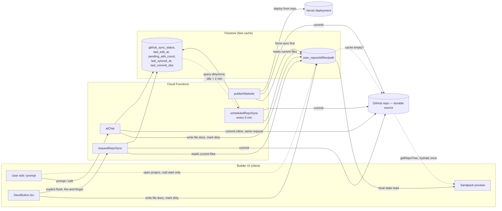

# AI website builder — unified engine plan

Status: phases 1–6 implemented **and deployed**, but **the actual sync
mechanics diverged from this plan** — see "Implementation status" below for
what's real vs. what was never built. The scheduled-sweep half of that gap
is now closed (`scheduledRepoSync`, written but **not yet verified live** —
see that section for the distinction from the rest of this doc's "verified
via direct Firestore/Function calls" claims). Phase 4/5 frontend wiring is
also done (see "Phases 4/5/7" below — no longer paused); phase 7 (cleanup)
is also done — its one remaining line item turned out to already be moot,
see "Cleanup" below. Companion to [CODE_REVIEW.md](./CODE_REVIEW.md). See also
[MULTI_AGENT_ORCHESTRATION.md](./MULTI_AGENT_ORCHESTRATION.md), which sits
upstream of everything in this document — it decides what `<file>` blocks
get produced; everything below about how those blocks get stored, synced,
and pushed to GitHub is unchanged by it. **That document itself is now
stale** in places (old file paths from before the `functions/agents/`
reorg, an agent count that predates Request Taker merging into Goal Setter)
— not corrected here since it's out of this document's scope; flagging so
it doesn't get read as current.

The pipeline code itself now lives under `functions/agents/`, organized
into 10 numbered layers (model config, system prompts, tool definitions,
tool execution, the agent loop, memory/context, guardrails, error handling,
streaming, evaluation) — see
[`functions/agents/README.md`](../functions/agents/README.md) for the
authoritative map of what lives where; this document doesn't repeat that
layout, only the read/write/sync path around it.
[engine-diagram.html](./engine-diagram.html) has the visual version of the
read/write/sync path below (not yet updated for the sync-mechanics
corrections in "Implementation status").

## Deployment state (new — this used to only exist as source)

Everything below was verified live, not just read in source, via direct
Firebase Auth + Cloud Function + Firestore REST calls against the real
`empirialdesigns` project:

- **Firestore rules exist and are deployed** (`firestore.rules` +
  `firestore.indexes.json`, both new — see "closing note" below, previously
  true). Scoped to `users/{uid}`, `user_repos/{repoId}` (ownership via
  `resource.data.user_id`), and `user_repos/{repoId}/files|chat_messages/*`
  (ownership resolved through the parent doc via `get()`/`getAfter()` —
  `getAfter()` specifically because `createWebsite` writes the parent repo
  doc and its first file docs in one atomic batch, and a plain `get()` only
  sees pre-batch state).
- **35 Cloud Functions are deployed** (Node 20 — Node 18 was decommissioned),
  not the "7" this doc originally shipped with. `createWebsite` runs with a
  300s timeout / 1GB, since full-site generation plus one GitHub API call per
  file for the initial commit routinely takes 20-50s+ and would otherwise hit
  the platform's default 60s HTTP timeout. The 7 this document actually
  covers (the builder read/write/sync path) are `createWebsite`, `aiChat`,
  `getRepoTree`, `getRepoContents`, `requestRepoSync`, `publishWebsite`,
  `getDeploymentStatus`. The other ~28 are unrelated product surfaces added
  since — SEO auditing (`seoAudit`, `pageSpeedAudit`), Google integrations
  (Business Profile, Search Console, Places/reviews, Analytics, OAuth
  connect/callback), domain connection (`connectDomain`/`getDomainStatus`/
  `disconnectDomain`), uptime monitoring, image generation, and the sales
  assistant — none of them touch the generation/sync path this doc describes,
  so they're out of scope here (see `functions/agents/README.md`'s own note
  on why they don't get a numbered-layer folder either).
- **Publishing a generated site is now real, and goes through Vercel, not
  Netlify** — `publishWebsite` force-syncs any pending Firestore edits to
  GitHub, then calls Vercel's API (`ensureVercelProject` →
  `createProductionDeployment` → `pollDeployment`) to build and deploy from
  that repo, and `getDeploymentStatus` lets the frontend keep polling past
  its own short wait window. `connectDomain`/`getDomainStatus`/
  `disconnectDomain` layer custom-domain support on top of the same Vercel
  project. **`createWebsite`'s `deploy_url` field is a leftover**: it still
  writes a guessed `https://${repoName}.netlify.app` string at creation time
  even though nothing ever deploys there — real deployment state lives in
  `vercel_deployment_status`/`vercel_production_url`, written by
  `publishWebsite` once a site is actually published. `buildRepoStatusSnapshot`
  (`06-memory-context/repoStatus.js`) reads the Vercel fields, not
  `deploy_url` — the stale field is dead weight, not something anything
  downstream trusts.
- **The pipeline calls DeepSeek directly**, not OpenRouter — see
  [MULTI_AGENT_ORCHESTRATION.md](./MULTI_AGENT_ORCHESTRATION.md)'s model
  section for why. `DEEPSEEK_API_KEY`/`DEEPSEEK_MODEL` in `functions/.env`.
- **GitHub token is configured** (`GITHUB_TOKEN`, classic PAT, `public_repo`
  scope only — deliberately excludes `delete_repo`; repos this app creates
  land under whichever personal GitHub account owns the token).
- **Firebase Hosting is also deployed** (`empirialdesigns.web.app`) for the
  marketing/platform frontend itself — separate from the GitHub repos this
  engine creates for generated client sites.

### Two real bugs found only by testing the deployed path, not by reading the code

- **`createWebsite`'s GitHub commit silently landed on an empty repo.** The
  repo was created with `auto_init: false` (zero Git objects at all), then
  the code did `PATCH /git/refs/heads/main` to point that branch at the new
  commit — but `PATCH` only *updates* an existing ref, and there was no
  `main` branch yet to update. That call 404s; the response was never
  checked, so `createWebsite` reported success while GitHub showed "This
  repository is empty." Blobs/tree/commit were real, dangling Git objects —
  nothing pointed to them. Fixed by creating the repo with `auto_init: true`
  (a real first commit exists immediately) and building the generated
  commit on top of it as a real parent, at which point `PATCH` is correct.
  Added `.ok` checks on every GitHub API call in this path while in there
  (closes part of the "does not check every GitHub API response" finding in
  `CODE_REVIEW.md`).
- **`generateRepoName`'s regex misfired on ordinary prompts.** It tried to
  extract an explicit name after "for"/"named"/"called", but "for" is an
  extremely common word in natural prompts ("a website **for a** bakery",
  "a landing page **for my** startup") — the regex grabbed whatever word
  came right after it regardless of meaning, so a prompt like "a fitness
  studio website for a boutique gym" produced a GitHub repo literally named
  `a`. Fixed by dropping `for` as a trigger (keeping only the unambiguous
  `named`/`called`) plus a stopword/length check as a second safety net.

## Implementation status

- ⚠️ **Phase 1 — Firestore schema, only half true today.** The
  sync-status fields (`github_sync_status`, `pending_edit_count`,
  `last_synced_at`, `last_commit_sha`) and the `user_repos/{id}/files/{path}`
  subcollection shape both exist and are what everything downstream reads —
  but **`createWebsite` does not write to the `files` subcollection at all**.
  It commits the generated files straight to GitHub (Step 7 in
  `functions/index.js`) and saves only top-level repo-doc fields (Step 8:
  `section_manifest`, `style`, `palette`, `repo_url`, etc.) — no per-file
  Firestore docs. A freshly-created project's Firestore file cache starts
  **empty**; it only gets populated by the cold-start GitHub-hydration
  fallback (`hydrateRepoFilesFromGithubIfEmpty`, see "Figure 2" below) the
  first time someone opens the builder for it, or by `aiChat` writing its
  own edited files on the first follow-up edit. This isn't a bug so much as
  a design that ended up different from the plan: GitHub, not Firestore, is
  the real source of truth for a fresh generation.
- ⚠️→✅ **Phase 2 — sync mechanics, the backstop half is now built, but not
  the trigger.** The original plan had two pieces beyond explicit sync: a
  per-write `onRepoFileWrite` Firestore trigger with an edit-count threshold,
  and a scheduled sweep as the backstop for whatever the trigger missed. Only
  the trigger stays unbuilt — `tryClaimSync`/the threshold-triggered
  invocation of a standalone `syncRepoToGitHub` **do not exist**. What's real
  today:
  1. **`aiChat` commits every edit to GitHub inline, in the same request** —
     not eventually. After the pipeline produces `<file>` blocks, `aiChat`
     writes them to `files/{path}` in Firestore *and* calls
     `commitFilesToGithub` before the response ends (`index.js:1134`-1210ish).
     There is no counter-driven batching — one edit, one commit, synchronously,
     before the user's stream finishes. The Firestore write itself now also
     stamps `github_sync_status: 'dirty'`, `last_edit_at`, and bumps
     `pending_edit_count` *before* attempting that commit, so a request that
     dies (timeout, crash) between the Firestore write and the GitHub commit
     still leaves a `dirty` repo the sweep below can find — previously it
     would have silently stayed `clean`-by-default with a stale GitHub copy.
     On a successful commit these fields flip back to `clean`; on a failed
     commit they go to `error` (previously `'pending'`, a value nothing else
     recognized — renamed so the sweep's query actually catches it).
  2. **`requestRepoSync`** (`index.js`, `exports.requestRepoSync`) — an
     explicit-flush HTTP endpoint, called by `SaveButton.tsx`. Now a thin
     wrapper over a shared `syncRepoFilesToGithub(repoId, ref, repo)` helper
     that reads the entire current `files` subcollection, commits it to
     GitHub, and marks the repo `clean`/`error`.
  3. **`publishWebsite`** always force-syncs the current `files` subcollection
     to GitHub before triggering a Vercel deployment (non-fatally — a sync
     failure there is logged and publish continues) and now also marks the
     repo `clean` on a successful pre-publish sync (previously it committed
     to GitHub but never updated `github_sync_status`, so a published repo
     could stay flagged `dirty` in Firestore forever).
  4. **`scheduledRepoSync`** (new — `functions.pubsub.schedule('every 5
     minutes')`) — the actual backstop. Queries `user_repos` where
     `github_sync_status in ['dirty', 'error']`, skips any repo whose
     `last_edit_at` is inside a 2-minute idle window (to avoid racing an edit
     still in flight), and calls the same `syncRepoFilesToGithub` helper for
     the rest. Catches the case the original plan's item 4 was meant to
     catch: a manual Firestore-only edit (`saveRepoFiles`, client-side) where
     the user never clicked Save/Publish and closed the tab — that path now
     also stamps `dirty`/`last_edit_at`/`pending_edit_count` itself (it
     didn't before; its own comment used to claim a Firestore trigger was
     watching it, which was never true).
  **Written but not yet verified live** — unlike the rest of this doc's
  "Deployment state" section (real Firebase Auth + Function + Firestore
  calls against the deployed project), this sweep hasn't been observed
  actually firing on a schedule or syncing a real dirty repo yet. No new
  Firestore composite index needed (`in` on a single field only requires the
  automatic single-field index).
- ✅ **Phase 3 — repoint `aiChat`.** It now resolves + verifies repo
  ownership before calling the AI provider at all. **Superseded/updated by
  [MULTI_AGENT_ORCHESTRATION.md](./MULTI_AGENT_ORCHESTRATION.md):** `aiChat`
  no longer makes one streaming OpenRouter call — it runs the multi-agent
  pipeline (moved from `functions/pipeline.js` to
  `functions/agents/05-agent-loop/pipeline.js` in the `agents/` reorg; the
  former Request Taker agent is now merged into Goal Setter, cutting every
  edit from 3 model calls to 2) and writes SSE frames to the client itself as
  each coder's result comes in, in the same wire shape a raw OpenRouter
  passthrough used, so the client-side reader is unaffected. Once the
  pipeline finishes, `aiChat` batch-writes the resulting `<file>` blocks to
  `files/{path}` **and commits them to GitHub in the same request** — see
  Phase 2 above; there is no separate trigger picking these writes up. The
  real client-side consumer of this stream is
  `src/features/builder/lib/aiChat.ts` → `AssistantPanel.tsx` (not
  `Preview.tsx`, which is currently unmounted — see the routing note under
  Phases 4/5/7 below). Accepts an explicit `repoId` in the request body
  (preferred) or falls back to an owner/name lookup for callers that don't
  send one yet.
- ✅ **Phase 6 — ownership checks**, folded into phase 3's work rather than
  done separately. Added a shared `resolveOwnedRepo(uid, { repoId } | {
  repoOwner, repoName })` helper and applied it to `aiChat`,
  `getRepoContents`, `getRepoTree`, `requestRepoSync`, and — added later,
  alongside the publish feature — `publishWebsite` and
  `getDeploymentStatus` too: every function that takes owner/repo (or
  repoId) from the client verifies `user_id === decodedToken.uid` before
  touching GitHub, Firestore, or Vercel for that repo, closing the finding
  in `docs/CODE_REVIEW.md`.
- ✅ **Phase 8 — publish/deploy, not part of the original plan.** Added
  after this document's phases 1-7 were drafted, so it has no earlier phase
  number to slot into. `publishWebsite` (`index.js:1597`) force-syncs
  Firestore's current `files` subcollection to GitHub (see Phase 2), injects
  a pending Google site-verification meta tag into `index.html` if one is
  waiting, then calls Vercel: `ensureVercelProject` (create-if-missing),
  `createProductionDeployment` (trigger a build from the GitHub repo),
  `pollDeployment` (wait a bounded window for it to finish before
  returning). `getDeploymentStatus` lets the frontend keep polling past that
  bounded window. `connectDomain`/`getDomainStatus`/`disconnectDomain` layer
  custom-domain support onto the same Vercel project. All of it writes back
  onto the `user_repos/{id}` doc (`vercel_project_id`,
  `vercel_deployment_status`, `vercel_production_url`,
  `custom_domain`/`custom_domain_status`) — the same doc Phase 1's
  sync-status fields live on, not a separate collection.
- ✅ **Phase 4 — frontend wiring, resolved.** The two-competing-plans tension
  described below resolved itself: `RepoManagement.tsx`/`Preview.tsx` (the
  other plan's starting point) are deleted (see `git log` — they're gone,
  along with the rest of the legacy generator flow, superseding the
  "Phases A–F" plan referenced below). `BuilderPage.tsx` is the one live
  builder surface. It calls `createWebsiteFromPrompt` (`repos.service.ts`)
  for a fresh prompt — which calls the real `createWebsite` Cloud Function,
  not a client-only stub — and `AssistantPanel.tsx` calls the real `aiChat`
  via `streamAiChat` (`aiChat.ts`) for follow-up edits. Both verified live,
  not just wired: see "Deployment state" above.
- ✅ **Phase 5 — routing, resolved differently than originally planned.**
  Rather than a standalone `/repos` + `/builder/:repoId`, the live routes are
  `/dashboard/chat?prompt=...` (fresh prompt) and
  `/dashboard/editor/:repoId` / `/dashboard/preview/:repoId` (existing
  project) — both rendering `BuilderPage`, dispatched from inside
  `Platform.tsx`. `App.tsx` itself only routes `/`, `/auth`, and
  `/dashboard/*`.
- ⏸️ **Phase 7 — cleanup — still open**, see "Cleanup" section below.

## Phases 4/5/7 overlap the frontend consolidation plan — resolved

This section originally flagged a risk: two uncoordinated plans both touched
`AssistantPanel.tsx`/`BuilderPage.tsx`/`App.tsx` — this plan's phases 4/5/7,
and a separate "Phases A–F" plan starting from `RepoManagement.tsx`/
`Preview.tsx`. That risk is now moot. `RepoManagement.tsx` and `Preview.tsx`
are deleted; `BuilderPage.tsx` (this plan's approach) is what's live. Kept
below for history, not as an open question anymore.

## Coordination note (frontend consolidation work) — schema fork, now closed

A parallel frontend plan extracted `RepoManagement.tsx`/`Preview.tsx` logic
into `repos.service.ts` and wired `BuilderPage` to real projects. Its first
version of `getRepoFiles`/`saveRepoFiles`/`createRepoFromPrompt` targeted a
single `vfs` blob field, not the `files` subcollection shape above — the
exact fork this note originally warned about, confirmed by reading the code
rather than assuming.

Fixed in `repos.service.ts`:
- `getRepoFiles`/`saveRepoFiles` now read/write `user_repos/{id}/files/{path}`
  (one doc per file), matching what `createWebsite`/`aiChat` write server-side.
  `RepoAutosave.tsx`/`SaveButton.tsx` needed no changes — the fix was entirely
  underneath them.
- `createRepoFromPrompt` seeds the subcollection + sync-status fields instead
  of a `vfs` field. It still creates no real GitHub repo (`repo_url: ''`) —
  `syncRepoToGitHub` (functions/index.js) now treats an empty `repo_url` as
  "not GitHub-backed yet" and no-ops instead of erroring, since there's
  nowhere to push to until something gives the project a real repo.
- `createRepoFromGithubUrl` now accepts an `idToken` and calls `getRepoTree`
  to actually pull the imported repo's source into the subcollection —
  previously it saved only `repo_owner`/`repo_name`/`repo_url` and every
  imported project silently opened on the starter template. `ImportRepoDialog.tsx`
  updated to pass the token.
- `deleteRepo` now batch-deletes the `files` subcollection along with the
  project doc — Firestore doesn't cascade-delete, so this would otherwise
  have started leaking orphaned file docs the moment the schema moved off a
  single field.

**Resolved:** `createRepoFromTemplate` no longer sets the placeholder
`github.com/empirial-templates/...` repo_url/repo_owner — it wasn't a real,
accessible repo for the shared `GITHUB_TOKEN`, and had a truthy `repo_url`
that would have slipped past `requestRepoSync`'s "no repo yet" guard (see
Phase 2 above — there is no separate `syncRepoToGitHub` function; this guard
lives inline in `requestRepoSync`/`publishWebsite` themselves). Confirmed
via grep that this function is currently unreachable from the UI
(Platform.tsx's template cards go through `createRepoFromPrompt` instead),
so this was dormant, not live — fixed anyway since it's exported and could
get wired up later. It now follows `createRepoFromPrompt`'s convention:
empty `repo_url`, seeded `files` subcollection, sync-status fields so the
guard treats it correctly if it ever starts receiving real edits.

**Resolved:** there was no `firestore.rules` file in this repo, which mattered
more once `repos.service.ts` started writing directly to the `files`
subcollection from the client — this was the actual cause of the
"Missing or insufficient permissions" errors seen when testing the live app.
`firestore.rules` + `firestore.indexes.json` now exist and are deployed —
see "Deployment state" above for the rule shape.

`SaveButton.tsx` also now calls `requestRepoSync` (fire-and-forget, after the
Firestore write succeeds) — confirmed by reading the code that this call was
missing entirely; "Save" previously only ever wrote to Firestore and never
pushed anything to GitHub on its own. This is the *only* automatic sync path
for a manual Firestore-only edit outside of `aiChat` (which syncs inline on
every turn regardless — see Phase 2 above); there was never a
threshold/sweep fallback for `SaveButton.tsx` to lean on instead.

## Figure 2 (cold-start GitHub fallback) — now actually implemented

Previously only true on paper. `getRepoFiles` was Firestore-only with no
fallback at all — a project with a real GitHub repo but an empty file cache
(data loss, or a repo that existed before these fixes) would silently open
on the starter template. Added:
- `hydrateFromGithub` in `repos.service.ts` — pulls a repo's source via
  `getRepoTree` and seeds the `files` subcollection. Shared by import and
  the new fallback (previously duplicated inline in `createRepoFromGithubUrl`
  alone).
- `hydrateRepoFilesFromGithubIfEmpty(repo, idToken)` — the fallback itself;
  no-ops for projects with no real `repo_url` (e.g. `createRepoFromPrompt`
  projects, where there's correctly nothing to fall back to).
- `BuilderPage.tsx` calls it only when `getRepoFiles` returns the
  `DEFAULT_FILES` constant by reference (i.e. the cache was actually empty)
  **and** the repo has a `repo_url` — so the common case (cache hit) pays
  no extra cost; the GitHub round trip only happens on the rare miss.

## Goal

Collapse the three uncoordinated generation paths (`functions/index.js` + GitHub,
`src/features/builder/` + mocked UI, `src/lib/claude.ts` legacy) into one engine:
GitHub is the durable, canonical store; Firestore is a fast write-behind cache
that live preview reads from. **The original goal also called for a
server-driven, trigger-based sync policy so no AI edit would ever wait on a
GitHub round trip — that half was never built** (see Phase 2 above). What
shipped instead is simpler and more synchronous than planned: `aiChat`
commits to GitHub inline, in the same request, before its response ends.

## Read path vs write path, as actually built

- **Write path (every AI edit via `aiChat`):** write the changed file docs to
  Firestore, then commit them to GitHub — both inline, in the same request,
  before the SSE stream ends. Not backgrounded: the user's turn genuinely
  waits on the GitHub commit, contrary to the original "never block on
  GitHub" goal above. In practice this is fine because a single small commit
  (a handful of section files) is fast relative to the LLM calls already in
  the same request.
- **Explicit sync path (`requestRepoSync` / `SaveButton.tsx`):** reads the
  current `files` subcollection and commits it, fire-and-forget from the
  client after a manual Firestore-only save.
- **Publish-time force-sync (`publishWebsite`):** always flushes Firestore's
  current `files` subcollection to GitHub before deploying — publish should
  never ship stale content even if something upstream failed to sync.
- **Scheduled sweep (`scheduledRepoSync`, every 5 minutes):** the backstop
  for anything the three paths above miss — any repo left `dirty`/`error`
  with no edit in the last 2 minutes gets flushed to GitHub the same way
  `requestRepoSync` does. There's still no *trigger* (no per-write Firestore
  function reacting the instant a file doc changes) — only this sweep — so a
  Firestore-only edit can sit unsynced for up to ~5-7 minutes in the worst
  case, not seconds.
- **Cold-start read path (opening a project):** check the Firestore cache
  first; fall back to GitHub (`getRepoTree`, via
  `hydrateRepoFilesFromGithubIfEmpty`) only if the cache is empty — see
  "Figure 2" above. This is the *only* path where GitHub is read as a
  fallback rather than written to.

**One node in this diagram — `scheduledRepoSync` — is a scheduled function;
every other arrow into GitHub is still a direct call from `aiChat`,
`requestRepoSync`, or `publishWebsite` in response to something a user did.
There is still no Firestore *trigger*** (nothing reacts the instant a
`files/{path}` doc is written — only the 5-minute sweep catches it, and only
after a 2-minute idle window). The diagram in
[engine-diagram.html](./engine-diagram.html) has not been updated to match
this and still shows the older design (a per-write trigger this repo still
doesn't have, described alongside a sweep it now does).

## Everything below this line is the original implementation plan

Kept for design rationale, not as an open TODO. **Read this section as
history, not as current behavior** — several of its central mechanisms (the
`onRepoFileWrite` trigger, `scheduledRepoSync`, the standalone
`syncRepoToGitHub` function, the edit-counter/idle-window sync policy) were
never actually implemented; see "Implementation status" above (Phase 2
especially) for what really ships today instead. Everything else here (the
Firestore schema shape, the ownership-check work, the frontend routing) is
still accurate.

## Firestore schema changes

- `user_repos/{id}` gains: `github_sync_status: 'clean' | 'dirty' | 'syncing' | 'error'`,
  `pending_edit_count`, `last_edit_at`, `last_synced_at`, `last_commit_sha`.
- New subcollection `user_repos/{id}/files/{path}` — **one document per file**,
  not one giant `vfs` field. This is the fix for the failure mode in the current
  `Preview.tsx` autosave: a single Firestore document caps at 1 MiB, and a
  generated site's full source can approach that as it grows. Per-file docs
  also mean a one-component edit writes one small doc instead of rewriting
  every file in the project.

## Cloud Functions changes

**Items 2 and 4 below now exist, in a different shape than described here —
item 3 (the Firestore trigger + edit-count threshold) still doesn't** — see
"Implementation status"'s Phase 2. What shipped: a shared
`syncRepoFilesToGithub` helper (item 2's job, minus the standalone-export
framing — it's an internal function, not its own Cloud Function) used by
both `requestRepoSync` and the new `scheduledRepoSync` (item 4's job, same
5-minute cadence, same "query dirty repos" idea, but keyed off
`github_sync_status`/`last_edit_at` rather than a `last_edit_at`-only query
with no status field). No threshold/counter decides *when* to sync per repo
— `aiChat` still commits immediately on every edit; only the sweep polls on
a timer. Kept below (mostly) verbatim for the original rationale.

1. **`aiChat`** — after parsing `<file>` blocks from the model response, write
   each changed file to `files/{path}` (not just stream text back), bump
   `pending_edit_count`, set `github_sync_status: 'dirty'`. Add the ownership
   check flagged in `docs/CODE_REVIEW.md`: verify `decodedToken.uid` owns the
   `repo_owner`/`repo_name` before touching it — apply the same check in
   `getRepoContents` and `getRepoTree`.
2. **`syncRepoToGitHub`** (new) — reads all docs in the `files` subcollection,
   commits the full current tree (blob → tree → commit → update ref, same
   shape `createWebsite` already uses). Full-tree pushes are safe to call
   repeatedly: git blobs are content-addressed, so re-pushing an unchanged
   file costs nothing and makes overlapping flushes idempotent — no diffing
   required.
3. **Firestore trigger on `files/{path}` writes** — increments
   `pending_edit_count` transactionally; when it reaches the threshold
   (default 3, configurable per repo later if needed), invokes
   `syncRepoToGitHub` directly. This makes the count/threshold decision
   server-side, so it isn't lost if the client disconnects right after the
   last edit lands.
4. **Scheduled sweep** (Cloud Scheduler, every ~5 min) — queries repos where
   `github_sync_status == 'dirty'` and `last_edit_at` is older than ~2 min,
   flushes each. This is the backstop for the case the counter never reaches
   3 (user makes 1–2 edits and closes the tab).
5. **Explicit Save/Publish/Export** — always force a flush via a callable
   function, regardless of counter state.
6. `createWebsite` keeps its job (initial generation + first commit) but
   switches its own file writes through the same `files` subcollection so the
   very first generation and all follow-ups go through one code path.

## Front-end changes

- `AssistantPanel.tsx`: flip `AI_WIRING_ENABLED` to true, call the real
  `aiChat` function. Remove the canned mock reply.
- `BuilderPage.tsx`: on mount, hydrate from the `files` subcollection (fall
  back to `getRepoTree` from GitHub only if that's empty); drop the static
  `starterTemplateFiles` as the default source for real projects (keep it only
  as the seed for a brand-new, not-yet-generated project).
- Small sync-status affordance in the topbar, read straight off
  `github_sync_status`/`pending_edit_count` (e.g. "3 unsynced edits" →
  "Synced to GitHub").
- `Preview.tsx`'s standalone Sandpack + ZIP-export + own chat loop folds into
  `BuilderPage` — same job, worse storage model. Keep the ZIP export feature,
  just move it.

## Routing changes

- `/repos` → project list (existing `RepoManagement.tsx` content), currently
  unmounted in `App.tsx` — mount it.
- Opening a project → a real `/builder/:repoId` route wired to that repo's
  `repo_owner`/`repo_name` (the current `/builder/:projectId` route just
  redirects to `/dashboard/projects`, which is dead — replace it).
- Retire the standalone `/preview/:id` destination once `BuilderPage` absorbs
  that job.

## Cleanup

- ✅ `src/pages/Dashboard.tsx`, `Builder.tsx`, `ChatInterface.tsx`,
  `GenerateWebsite.tsx`, `template.tsx`, plus `RepoManagement.tsx` and
  `Preview.tsx` — all deleted (see `docs/TO_DELETE.md`'s history in `git
  log`; that file is itself deleted now that its list is empty).
- ✅ `CLAUDE.md`'s "Current transition state" section updated to match.
- ✅ `src/lib/claude.ts` / `LovableSidebar.tsx` — re-checked: neither file
  exists in this checkout (`find src -iname "*claude*"` / `-iname
  "*LovableSidebar*"` both come back empty, and neither shows up in `git
  log` as ever having been deleted here either) — this line was stale, not
  actually an open item. Phase 7 has nothing left outstanding.

## Suggested implementation order

1. Firestore schema (`files` subcollection + sync-status fields) — no
   behavior change yet, just the shape.
2. `syncRepoToGitHub` + the Firestore-write trigger + the scheduled sweep.
3. Point `aiChat` and `createWebsite` at the new subcollection.
4. Wire `BuilderPage`/`AssistantPanel` to the real functions; add the
   sync-status UI.
5. Fix routing (`/repos`, `/builder/:repoId`); fold `Preview.tsx` in.
6. Ownership checks on every function that takes `owner`/`repo` from the
   client.
7. Delete the legacy paths; update `CLAUDE.md`.

## Open questions

- Edit-counter threshold: moot for now — no threshold/counter gates *when*
  a sync happens (`aiChat` still syncs immediately on every edit); only the
  sweep's idle window below does.
- Idle-sweep window: `scheduledRepoSync` shipped with 2 minutes, on a
  5-minute cadence — worst case ~5-7 minutes of staleness for a
  Firestore-only edit nobody explicitly Saved. Not yet tuned against real
  traffic since the sweep hasn't been observed live yet (see Phase 2).
- Does `Preview.tsx`'s ZIP export stay as-is, or should export also offer
  "clone the GitHub repo" now that GitHub is guaranteed current within one
  sync cycle? (`Preview.tsx` itself is deleted — this would live in
  `BuilderPage` now, if it happens at all.)
- ✅ The topbar sync-status affordance described under "Front-end changes"
  below is now built: `SyncStatusBadge.tsx`, rendered in `BuilderPage.tsx`'s
  preview-pill header next to `SaveButton` (hidden for repos with no
  `repo_url`). `Repo` now carries `github_sync_status`/`pending_edit_count`/
  `last_edit_at`/`last_synced_at`/`last_commit_sha`, kept live via an
  `onSnapshot` listener on the repo doc rather than a one-shot fetch, so it
  reflects `aiChat`/`saveRepoFiles`/`scheduledRepoSync` writes as they land.
